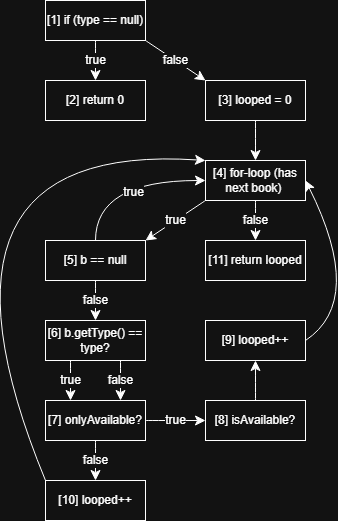

# White Box Testing Report - Assignment 3

**Student Name:** William Maroon
**ASU ID:** wmaroon
**Date:** 6/10/26

---

## Part 1: Control Flow Graph for countBooksByType()

### Graph Description

Draw or describe your control flow graph here. Include:
- Node numbers and what they represent
- Edges showing control flow
- Conditions at decision points

**You can hand-draw and insert an image, or describe it in text format.**

### Node Coverage Sequences

List the sequences needed for complete node coverage:

**Sequence 1:**
- **Path:** 1,2
- **Purpose:** Null type
- **Test case:**

@Test
public void testCountBooksByType_NullType() {
    assertEquals(0, checkout.countBooksByType(null, false));
}
**Sequence 2:**
- **Path:** 1,3,4,11
- **Purpose:** Empty inventory
- **Test case:**

@Test
public void testCountBooksByType_EmptyInventory() {
    int result =
        checkout.countBooksByType(Book.BookType.FICTION, false);

    assertEquals(0, result);
}

**Sequence 3:**
- **Path:**  1,3,4,5,6,7,10,4,11
- **Purpose:** Matching type, onlyAvailable false
- **Test case:**
@Test
public void testCountBooksByType_CountAllMatching() {

    Book b =
        new Book("1","A","A",Book.BookType.FICTION,1);

    checkout.addBook(b);

    int result =
        checkout.countBooksByType(Book.BookType.FICTION,false);

    assertEquals(1,result);
}

**Sequence 4:**
- **Path:** 1,3,4,5,6,7,8,9,4,11
- **Purpose:** Matching type, onlyAvailable true
- **Test case:**
@Test
public void testCountBooksByType_OnlyAvailable() {

    Book b =
        new Book("1","A","A",Book.BookType.FICTION,1);

    checkout.addBook(b);

    int result =
        checkout.countBooksByType(Book.BookType.FICTION,true);

    assertEquals(1,result);
}

### Edge Coverage Sequences

List the sequences needed for complete edge coverage:

**Sequence 1:** Type does not match
- **Edges covered:** 1,3,4,5,6,4,11
- **Test case:**

@Test
public void testCountBooksByType_NonMatchingType() {

    Book b =
        new Book("1","A","A",Book.BookType.NONFICTION,1);

    checkout.addBook(b);

    int result =
        checkout.countBooksByType(Book.BookType.FICTION,false);

    assertEquals(0,result);
}

**Sequence 2:**
- **Edges covered:** 1,3,4,5,6,7,8,4,11
- **Test case:** onlyAvailable ture book unavailable

@Test
public void testCountBooksByType_UnavailableBook() {

    Book b =
        new Book("1","A","A",Book.BookType.FICTION,1);

    b.setAvailableCopies(0);

    checkout.addBook(b);

    int result =
        checkout.countBooksByType(Book.BookType.FICTION,true);

    assertEquals(0,result);
}
---

## Part 2: Code Coverage with JaCoCo

### Initial Coverage for Checkout.java

**Before adding tests:**
- **Line Coverage:** ___%
- **Branch Coverage:** ___%

### Coverage for countBooksByType()

**Before additional tests:**
- **Branch Coverage:** 32%

**After reaching 80% branch coverage:**
- **Branch Coverage:** 72%
- **Tests added:**

  
    @Test
    public void testCalculateFineZeroDays() {
        assertEquals(0.0,
                checkout.calculateFine(0, Book.BookType.FICTION));
    }

    @Test
    public void testCalculateFineFiveDays() {
        assertEquals(1.25,
                checkout.calculateFine(5, Book.BookType.FICTION));
    }

    @Test
    public void testCalculateFineTenDays() {
        assertEquals(3.25,
                checkout.calculateFine(10, Book.BookType.NONFICTION));
    }

    @Test
    public void testCalculateFineReferenceBook() {
        assertEquals(2.50,
                checkout.calculateFine(5, Book.BookType.REFERENCE));
    }

    @Test
    public void testCalculateFineCap() {
        assertEquals(25.0,
                checkout.calculateFine(100, Book.BookType.FICTION));
    }

    @Test
    public void testReturnBookInvalidPatron() {
        assertEquals(-1.0,
                checkout.returnBook("123", null));
    }

    @Test
    public void testReturnBookNotOverdue() {

        Patron p = new Patron(
                "P1",
                "Bob",
                "bob@test.com",
                Patron.PatronType.STUDENT);

        Book b = new Book(
                "1234567890",
                "Book",
                "Author",
                Book.BookType.FICTION,
                1);

        checkout.registerPatron(p);
        checkout.addBook(b);

        checkout.checkoutBook(b, p);

        double fine = checkout.returnBook("1234567890", p);

        assertEquals(0.0, fine);
    }

    @Test
    public void testReturnBookNullPatron() {
        assertEquals(-1.0,
            checkout.returnBook("1234567890", null));
    }

### Final Overall Coverage

- **Line Coverage:** 86%
- **Branch Coverage:** 72%

---

## Part 3: checkoutBook() Implementation

### Test-Driven Development Process

**Number of tests from BlackBox assignment:** 24

**Implementation challenges:**
1. Making the requirements match the test case
2. Fully understanding the logic, and what the order of the logic was

**All tests passing:** [Yes/No]
Yes
---

## Part 4: Reflection

**How did white-box testing differ from black-box testing?**
Whitebox let you interact directly with the data/functions. It was easier to formulate.
**Which approach do you find more effective? Why?**
Whitebox was able to cover more test cases quickly
**Would you prefer TDD or implementation first test later? Why?**
Implemenation because it gives you a solid base to work from